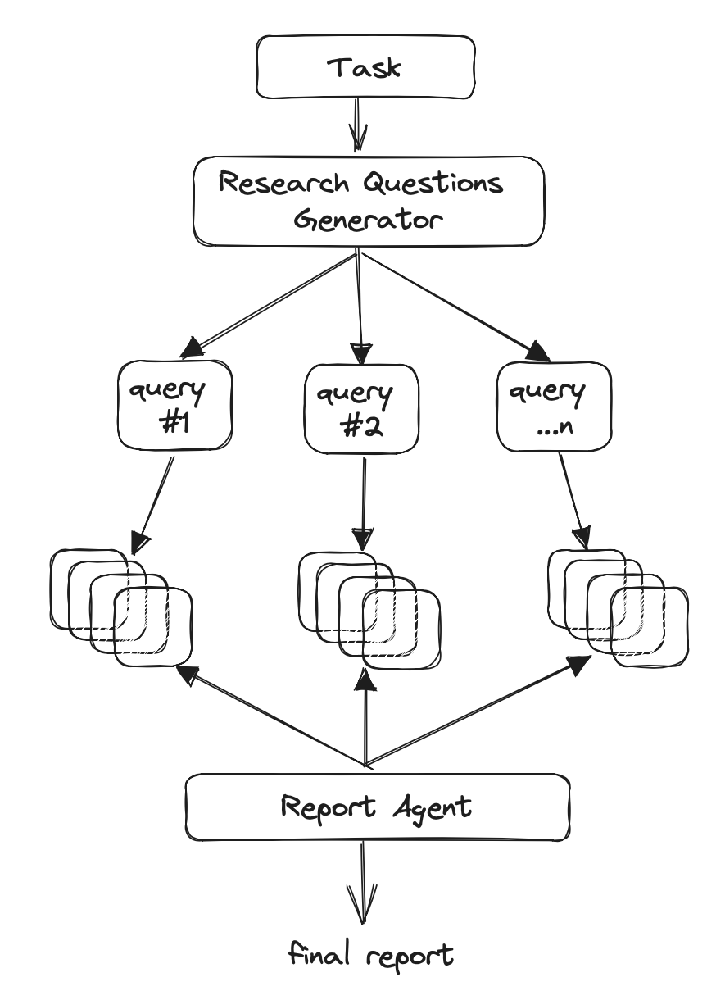

# Research-Compass

***!!! For research purposes only !!!***

Navigating the research landscape with AI-powered reviews. This project uses Langchain agents to
perform review on the topic user requested.

## What are AI Agents?

Artificial Intelligence (AI) agents are software programs or systems that utilize AI to perform tasks or services for
individuals or businesses. These agents are designed to interact with humans through natural language conversations
using voice or text. AI agents work by understanding and interpreting human language, learning from interactions, and
accessing information to respond to user queries or execute actions.

## Using Langchain to Create AI Agents

Langchain is a platform that allows for the quick prototyping of large language model applications and offers
flexibility and simplicity in creating agents. Langchain empowers you to build dynamic AI agents that reason and act on
their own.

## Getting Started

In this project, we're creating a set of agents tasked with searching the web given a question and summarizing the top 3
results: it reads, analyzes, and synthesizes information, all guided by language models.

Below image is how we're designing the project. This is heavily adapted from this [GitHub
Gist](https://gist.github.com/hwchase17/69a8cdef9b01760c244324339ab64f0c) and [GitHub project](https://github.com/assafelovic/gpt-researcher).



## How to run?

These instructions will get you a copy of the project up and running on your local machine for development and testing purposes.

### Prerequisites

You need to have Docker installed on your machine. You can download [Docker here](https://www.docker.com/products/docker-desktop).

### Installing

*1.* Clone the repository - change in to directory of your choice and run:

```sh
git clone https://github.com/tkmamidi/research-compass.git
```

*2.* Navigate to the project directory

```sh
cd RESEARCH-COMPASS
```

*3.* Setup OpenAI API key

Please signup and create new api key in [openAI platform](https://platform.openai.com/api-keys) and update your OPENAI_API_KEY in the [Dockerfile](./Dockerfile).

*4.* Want to monitor the application and responses? (Optional)

See what’s happening with your application, so you can take action when needed and optimize.

Please signup and create new api key in [Langsmith platform](https://www.langchain.com/langsmith) and update your LANGCHAIN_API_KEY in the [Dockerfile](./Dockerfile).

*5.* Build the Docker image

```sh
docker build -t research-compass .
```

*6.* Run the Docker container

```sh
docker run -p 8000:8000 --name research-compass research-compass
```

*7.* Use this link in your browser to chat -

[http://localhost:8000/research-compass/playground/](http://localhost:8000/research-compass/playground/)

## Built With

* [Python](https://www.python.org/) - The programming language used
* [Docker](https://www.docker.com/) - Used for containerization

## Contributing

We welcome contributions! [See the docs for guidelines](./CONTRIBUTING.md).

## Authors

* **Tarun Mamidi** - [tkmamidi](https://github.com/tkmamidi)
